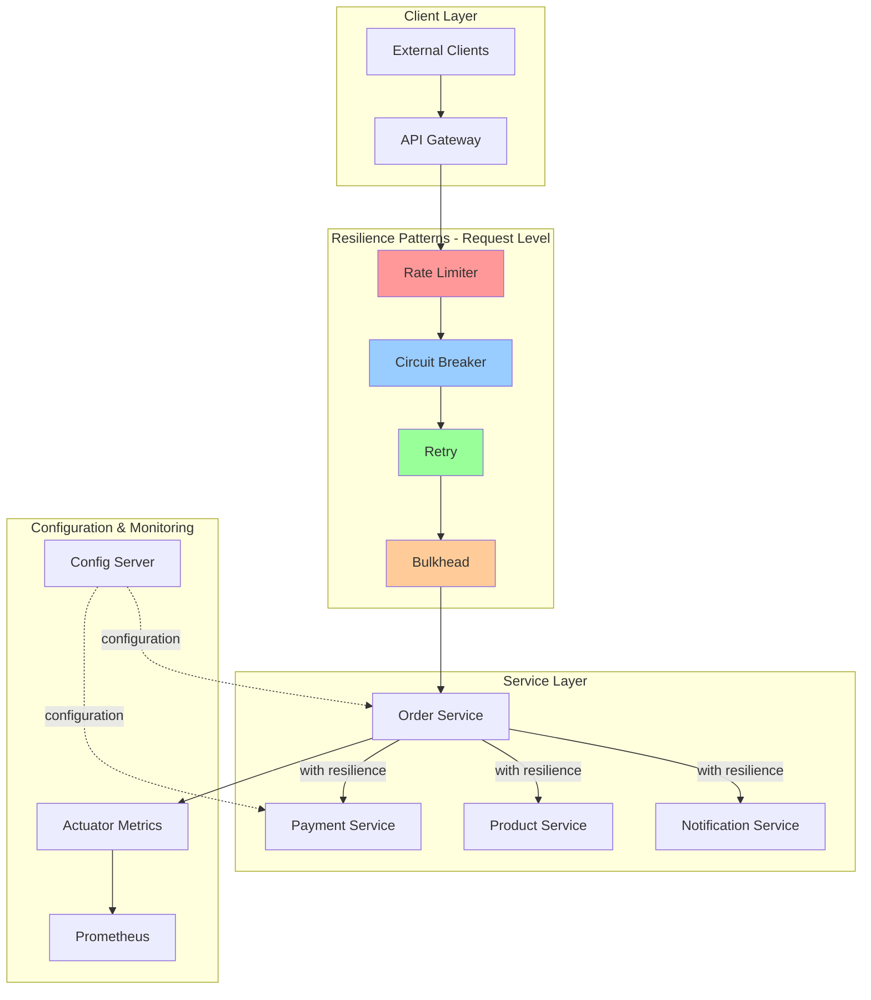

# Design Document - Fault Tolerance with Resilience4J

## Overview

This document outlines the technical design for implementing comprehensive fault tolerance across the e-commerce microservices platform using Resilience4J. The design introduces retry mechanisms, circuit breakers, rate limiting, and bulkhead patterns to ensure system resilience and prevent cascading failures. The implementation will be integrated into the existing Spring Boot microservices architecture with centralized configuration management through Spring Cloud Config Server.

## Steering Document Alignment

### Technical Standards

- **Spring Boot 3.2.2**: Leverage existing Spring Boot infrastructure for Resilience4J integration
- **Spring Cloud 2023.0.0**: Utilize Spring Cloud Config for centralized resilience configuration
- **Maven**: Add Resilience4J dependencies to parent POM for consistent versioning across microservices
- **PostgreSQL**: Store resilience metrics history (optional future enhancement)
- **RESTful APIs**: Apply resilience patterns to inter-service communication

### Project Structure

- **common-lib**: Create shared resilience configuration utilities and custom annotations
- **Service-specific configuration**: Each microservice will have its own resilience configuration file
- **Actuator integration**: Expose resilience metrics through existing Spring Boot Actuator endpoints
- **Consistent patterns**: Follow existing service structure (config, controller, service, repository layers)

## Code Reuse Analysis

### Existing Components to Leverage

- **common-lib module**: Extend with shared Resilience4J configuration classes, custom annotations, and utility methods
- **Spring Cloud Config Server**: Leverage existing configuration infrastructure for managing resilience settings
- **Spring Boot Actuator**: Utilize existing monitoring endpoints to expose resilience metrics
- **RestTemplate/WebClient beans**: Wrap existing HTTP clients with resilience decorators
- **Feign Clients**: Integrate resilience patterns into existing Feign client configurations
- **Exception handling**: Extend existing global exception handlers to handle resilience-specific exceptions

### Integration Points

- **API Gateway**: Apply rate limiting and circuit breakers for external client requests
- **Order Service → Payment Service**: Implement circuit breaker and retry for payment calls
- **Order Service → Product Service**: Add bulkhead and retry for inventory checks
- **Notification Service**: Apply rate limiter for email/SMS provider calls
- **All inter-service communication**: Implement resilience patterns on all REST calls and Feign clients
- **Spring Cloud Config**: Fetch resilience configurations from config repository

## Architecture

The fault tolerance implementation follows a layered approach with Resilience4J patterns wrapping service calls at multiple levels:



### Resilience Pattern Execution Order

For each service call, resilience patterns are applied in the following order:

1. **Bulkhead**: Allocate thread/semaphore from isolated pool
2. **Rate Limiter**: Check if call is within rate limits
3. **Circuit Breaker**: Evaluate circuit state (open/closed/half-open)
4. **Retry**: Execute call with retry logic on failures

## Components and Interfaces

### Component 1: Resilience Configuration in common-lib

- **Purpose**: Provide shared configuration classes and utilities for Resilience4J
- **Interfaces**:
  - `ResilienceProperties`: Configuration properties bean
  - `@Resilient` annotation: Custom annotation for declarative resilience
  - `ResilienceUtils`: Helper methods for common resilience operations
- **Dependencies**: Resilience4J Spring Boot Starter, Spring Cloud Config
- **Location**: `common-lib/src/main/java/com/ecommerce/common/resilience/`

### Component 2: Circuit Breaker Configuration

- **Purpose**: Configure circuit breakers for each external service dependency
- **Interfaces**:
  - `CircuitBreakerConfig`: Define circuit breaker parameters per service
  - `CircuitBreakerRegistry`: Registry of all circuit breakers
  - Circuit breaker events: State transitions, failures, successes
- **Dependencies**: Resilience4J Circuit Breaker module
- **Configuration Parameters**:
  - Failure rate threshold: 50%
  - Slow call rate threshold: 50%
  - Slow call duration: 5 seconds
  - Permitted calls in half-open state: 5
  - Sliding window size: 100 requests
  - Wait duration in open state: 60 seconds

### Component 3: Retry Configuration

- **Purpose**: Configure retry mechanisms for transient failures
- **Interfaces**:
  - `RetryConfig`: Define retry parameters per service
  - `RetryRegistry`: Registry of all retry configurations
  - Retry events: Retry attempts, success after retry, max attempts exceeded
- **Dependencies**: Resilience4J Retry module
- **Configuration Parameters**:
  - Max attempts: 3
  - Wait duration: 1 second (initial)
  - Backoff strategy: Exponential (multiplier: 2)
  - Retryable exceptions: IOException, TimeoutException, HttpServerErrorException
  - Ignored exceptions: HttpClientErrorException, AuthenticationException

### Component 4: Rate Limiter Configuration

- **Purpose**: Enforce rate limits on outbound calls to external services
- **Interfaces**:
  - `RateLimiterConfig`: Define rate limits per service
  - `RateLimiterRegistry`: Registry of all rate limiters
  - Rate limiter events: Permit acquired, permit rejected
- **Dependencies**: Resilience4J Rate Limiter module
- **Configuration Parameters**:
  - Limit refresh period: 1 minute
  - Limit for period: Service-specific (e.g., payment: 100, email: 500)
  - Timeout duration: 5 seconds

### Component 5: Bulkhead Configuration

- **Purpose**: Isolate resources through thread pool or semaphore-based bulkheads
- **Interfaces**:
  - `BulkheadConfig`: Define bulkhead parameters per service
  - `ThreadPoolBulkheadConfig`: Thread pool-specific configuration
  - `BulkheadRegistry`: Registry of all bulkheads
  - Bulkhead events: Call permitted, call rejected, call finished
- **Dependencies**: Resilience4J Bulkhead module
- **Configuration Parameters**:
  - Max concurrent calls: Service-specific (e.g., payment: 10, product: 20)
  - Max wait duration: 100ms
  - Thread pool size: 10-50 depending on service
  - Queue capacity: 100

### Component 6: Resilience Aspect/Decorator

- **Purpose**: Apply resilience patterns to service calls using AOP or decorators
- **Interfaces**:
  - `@Resilient`: Custom annotation with pattern configuration
  - `ResilienceAspect`: AOP aspect to intercept annotated methods
  - `ResilienceDecorator`: Utility to wrap REST clients
- **Dependencies**: Spring AOP, Resilience4J decorators
- **Reuses**: Existing exception handling framework, logging utilities

### Component 7: Metrics and Monitoring

- **Purpose**: Expose resilience metrics through Spring Boot Actuator
- **Interfaces**:
  - Actuator endpoints: `/actuator/circuitbreakers`, `/actuator/ratelimiters`, etc.
  - Micrometer metrics: Counter, gauge, timer for each pattern
  - Custom health indicators: Circuit breaker health contributor
- **Dependencies**: Spring Boot Actuator, Micrometer, Prometheus registry
- **Integration**: Existing Prometheus/Grafana monitoring stack

### Component 8: Configuration Management

- **Purpose**: Externalize and centralize resilience configurations
- **Interfaces**:
  - YAML configuration files per service
  - Spring Cloud Config integration
  - Configuration refresh mechanism
- **Dependencies**: Spring Cloud Config Client
- **Location**: Config repository under `config-repo/resilience/`

## Data Models

### Circuit Breaker Configuration Model

```yaml
resilience4j:
  circuitbreaker:
    instances:
      payment-service:
        registerHealthIndicator: true
        slidingWindowSize: 100
        minimumNumberOfCalls: 10
        permittedNumberOfCallsInHalfOpenState: 5
        automaticTransitionFromOpenToHalfOpenEnabled: true
        waitDurationInOpenState: 60s
        failureRateThreshold: 50
        slowCallRateThreshold: 50
        slowCallDurationThreshold: 5s
        recordExceptions:
          - org.springframework.web.client.HttpServerErrorException
          - java.io.IOException
        ignoreExceptions:
          - com.ecommerce.common.exception.BusinessException
```

### Retry Configuration Model

```yaml
resilience4j:
  retry:
    instances:
      payment-service:
        maxAttempts: 3
        waitDuration: 1s
        enableExponentialBackoff: true
        exponentialBackoffMultiplier: 2
        retryExceptions:
          - org.springframework.web.client.ResourceAccessException
          - java.net.SocketTimeoutException
        ignoreExceptions:
          - org.springframework.web.client.HttpClientErrorException
```

### Rate Limiter Configuration Model

```yaml
resilience4j:
  ratelimiter:
    instances:
      payment-gateway:
        limitForPeriod: 100
        limitRefreshPeriod: 1m
        timeoutDuration: 5s
      email-service:
        limitForPeriod: 500
        limitRefreshPeriod: 1m
        timeoutDuration: 5s
```

### Bulkhead Configuration Model

```yaml
resilience4j:
  bulkhead:
    instances:
      payment-service:
        maxConcurrentCalls: 10
        maxWaitDuration: 100ms
  thread-pool-bulkhead:
    instances:
      product-service:
        maxThreadPoolSize: 20
        coreThreadPoolSize: 10
        queueCapacity: 100
        keepAliveDuration: 20ms
```

## Error Handling and Fallback Strategies

### Circuit Breaker Fallback

- Return cached response if available
- Return default/empty response with appropriate HTTP status (503 Service Unavailable)
- Log detailed error for investigation

### Rate Limiter Fallback

- Return 429 Too Many Requests status
- Include Retry-After header with wait duration
- Queue request for later processing (optional)

### Bulkhead Fallback

- Return 503 Service Unavailable status
- Log resource exhaustion event
- Trigger alerts for capacity planning

### Retry Exhaustion

- Log all retry attempts with timestamps
- Return original exception to caller
- Increment failure metrics

## Implementation Approach

### Phase 1: Core Infrastructure (common-lib)

1. Add Resilience4J dependencies to parent POM
2. Create resilience configuration classes in common-lib
3. Implement custom `@Resilient` annotation
4. Create configuration properties classes
5. Add utility methods for resilience decorators

### Phase 2: Service-Specific Configuration

1. Create resilience configuration YAML files per service in Config Server repository
2. Configure circuit breakers for critical service-to-service calls
3. Add retry configuration for transient failure scenarios
4. Set up rate limiters for external API calls
5. Define bulkheads for resource isolation

### Phase 3: Integration with Existing Services

1. Annotate service methods with `@Resilient`
2. Wrap RestTemplate/WebClient beans with resilience decorators
3. Configure Feign clients with resilience integration
4. Update exception handlers to handle resilience exceptions
5. Add fallback methods for critical operations

### Phase 4: Monitoring and Observability

1. Enable Actuator endpoints for resilience metrics
2. Configure Micrometer for Prometheus metric export
3. Create Grafana dashboards for resilience visualization
4. Set up alerts for circuit breaker state changes
5. Implement health indicators for circuit breakers

### Phase 5: Testing and Validation

1. Write unit tests for resilience configurations
2. Implement integration tests with WireMock to simulate failures
3. Perform chaos engineering tests (e.g., kill services, inject latency)
4. Validate metric collection and alerting
5. Load testing to verify bulkhead and rate limiter effectiveness

## Configuration Example: Order Service

```java
@Configuration
public class OrderServiceResilienceConfig {

    @Bean
    public Customizer<Resilience4JCircuitBreakerFactory> defaultCustomizer() {
        return factory -> factory.configureDefault(id -> new Resilience4JConfigBuilder(id)
            .circuitBreakerConfig(CircuitBreakerConfig.ofDefaults())
            .timeLimiterConfig(TimeLimiterConfig.custom()
                .timeoutDuration(Duration.ofSeconds(5))
                .build())
            .build());
    }
}

@Service
public class PaymentClientService {

    @CircuitBreaker(name = "payment-service", fallbackMethod = "paymentFallback")
    @Retry(name = "payment-service")
    @RateLimiter(name = "payment-gateway")
    @Bulkhead(name = "payment-service")
    public PaymentResponse processPayment(PaymentRequest request) {
        return restTemplate.postForObject(
            paymentServiceUrl + "/payments",
            request,
            PaymentResponse.class
        );
    }

    private PaymentResponse paymentFallback(PaymentRequest request, Exception ex) {
        log.error("Payment service unavailable, returning fallback response", ex);
        return PaymentResponse.builder()
            .status("PENDING")
            .message("Payment service temporarily unavailable, will retry shortly")
            .build();
    }
}
```

## Testing Strategy

### Unit Testing

- Test each resilience pattern configuration in isolation
- Verify fallback methods are called correctly
- Test configuration validation and error handling

### Integration Testing

- Use WireMock to simulate slow/failing services
- Verify circuit breaker opens after threshold failures
- Test retry behavior with various exception types
- Validate rate limiter enforcement
- Confirm bulkhead thread isolation

### Chaos Engineering

- Randomly kill service instances during load tests
- Inject network latency and timeouts
- Simulate service slow-downs
- Verify system graceful degradation
- Monitor metric collection during chaos

### Performance Testing

- Measure resilience pattern overhead (<5ms target)
- Load test with high concurrency to validate bulkheads
- Verify rate limiter accuracy under high load
- Test circuit breaker performance with state transitions

## Rollout Strategy

1. **Development Environment**: Deploy to dev with verbose logging
2. **Staging Environment**: Test with production-like load
3. **Canary Deployment**: Enable for 10% of production traffic
4. **Gradual Rollout**: Increase to 50%, then 100% over 2 weeks
5. **Monitoring Phase**: Continuously monitor metrics and adjust configurations

## Success Metrics

- Circuit breaker prevents at least 90% of calls to failing services
- Retry success rate > 70% for transient failures
- Rate limiter accuracy > 99% (no burst violations)
- Bulkhead isolation: Failed service doesn't impact others
- Overall system availability improvement > 15%
- P95 latency increase < 5ms due to resilience overhead
